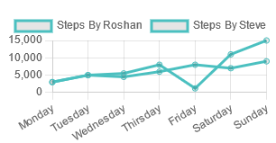
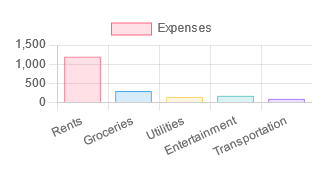
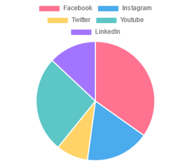

# Chart JS

Understanding the concept of chart.js, its implementation and use-case scenarios.

## Installing / Getting started

A quick introduction of the minimal setup you need to get the app running.

``` js
npm create vite@latest
```
This create the app. After that you need to write the project & package name (you can even skip this part).
<br>Then choose the required framework using which you intend to build this app (In this case, I have choosen React).
<br>Then choose the desired variant (Here you have 4 options: TypeScript, TypeScript with compiler, JavaScript & JavaScript with compiler). Here, I choosed JavaScript

You can even create react app through create-react-app but the execution speed of the program created through create-react-app (CRA) is slow compared to that of vite. CRA is used to create those app which is bit complex and large.
<br>To create React app through CRA, run the following command:

``` js
npx create-react-app "AppName"
```

Then run the following commands:
``` js
cd "folder_name"
```

``` js
npm install
```
**OR**
``` js
npm i
```
This code install the necessary packages required to build the project
``` js
npm run dev
```
It starts the development server. On following the link provided, you get to see the sample app.
<br>If you ever intend to change the command for runnig the code, you can do that by making some changes in the package.json file.

### Initial Configuration

Here are some of the dependencies and devDependencies packages needed to be installed for the project development
``` js
npm i chart.js react-chartjs-2
```
This package allows you to make chart easily

#### Working with chart.js

In order to use graph functionality provided by chart.js, import the chart/graph you want to use in the respective jsx/js file.
** For Line graph
``` js
import {Line} from 'react-chartjs-2'
```
** For Bar graph
``` js
import {Bar} from 'react-chartjs-2'
```
** For Pie Chart
``` js
import {Pie} from 'react-chartjs-2'
```
Also import all the elements, tools and scales according to your requirement to make the connection between react and chart.js library.
<br> The below is done for Line graph;
``` js
import { Chart as ChartJS, CategoryScale, LinearScale, PointElement, LineElement, Title, Tooltip, Legend } from "chart.js"
```
Register all the elements imported using the command below;
``` js
ChartJS.register(CategoryScale, LinearScale, PointElement, LineElement, Title, Tooltip, Legend);
```
Without registering the elements, it won't render everything inside your website
<br> In case of bar graph, you don't need "PointElement" and you replace "LineElement" with "BarElement". Other's the same. Registration is also done in the same way;
``` js
import { Chart as ChartJS, CategoryScale, LinearScale, BarElement, Title, Tooltip, Legend } from "chart.js"
```
And for Pie chart, you need Tooltip, Legend and ArcElement
``` js
import { Chart as ChartJS, Tooltip, Legend, ArcElement } from "chart.js"
```
Now to display all of those elements inside your website, you use either Line or Bar or Pie components according to your requirements as
``` js
//importing data
import { lineChartData } from "../FAKE_DATA";

const LineGraph = () => {
  const options = {}

  return (
    <>
     <Line options={options} data={lineChartData}/>
    </>
  )
}
```
It takes two arguments options and data. Options can be left empty but data can't. Options is used to specify different configurations and changes that you want to put in your graph. But for data
<br> Your data should be an object and should contain two things "labels" and "datasets". You can put multiple lines in the same "datasets". "labels" represents X-axis and "datasets" represents Y-axis.
``` js
export const lineChartData = {
    labels: [
        "Monday", 
        "Tuesday", 
        "Wednesday",
        "Thirsday", 
        "Friday",
        "Saturday",
        "Sunday"
    ],
    datasets: [
        {
            label: "Steps",
            data: [3000, 5000, 4500, 6000, 8000, 7000, 9000],
            borderColor: "rgb(75, 192, 192)",
        },
    ],
};
```
The number of "data" values inside "datasets" must be equal to the number of "labels". In this case, there are 7 values in "labels" as well as 7 values in "data". Each of the individual value of "data" shares the same array position with the value of "labels". You can specify anything else you want (for eg: in this case I have specified borderColor). You can even specify backgroundColor or anything else.
<br> You can add another datasets in the same way as
``` js
datasets: [
        {
            label: "Steps By Roshan",
            data: [3000, 5000, 4500, 6000, 8000, 7000, 9000],
            borderColor: "rgb(75, 192, 192)",
        },
        {
            label: "Steps By Steve",
            data: [3000, 5000, 5500, 8000, 1200, 11000, 15000],
            borderColor: "rgb(75, 192, 192)",
        },
    ],
```

##### Line Graph reference image



In case of Bar graph, you can put individual colors making an array as;
``` js
export const barChartData = {
    labels: [
        "Rents", 
        "Groceries", 
        "Utilities",
        "Entertainment", 
        "Transportation",
    ],
    datasets: [
        {
            label: "Expenses",
            data: [1200, 300, 150, 180, 100],
            borderColor: [
                "rgba(255, 99, 132, 1)",
                "rgba(54, 162, 235, 1)",
                "rgba(255, 206, 86, 1)",
                "rgba(75, 192, 192, 1)",
                "rgba(153, 102, 255, 1)",
            ],
            backgroundColor: [
                "rgba(255, 99, 132, 0.2)",
                "rgba(54, 162, 235, 0.2)",
                "rgba(255, 206, 86, 0.2)",
                "rgba(75, 192, 192, 0.2)",
                "rgba(153, 102, 255, 0.2)",
            ],
            borderWidth: 1,
        },
    ],
};
```

##### Bar Graph reference image



##### Pie Chart reference image



[comment]: # (## Developing
In order to develop the project, follow these steps)

[comment]: # (### Building
To build the project for deployment, follow these steps)

[comment]: # (### Deploying/Publishing
To deploy the project to a server, follow these steps)

[comment]: # (## Features)

[comment]: # (## Contributing)

## Links
+ <a href = "https://github.com/chyroshan066/dp_basicReact">Project homepage</a>
+ Other Projects:
  - <a href = "https://github.com/chyroshan066/text-formatter">Text Formatter</a>
  - <a href = "https://github.com/chyroshan066/newsApp">News App</a>
+ <a href = "https://github.com/chyroshan066">Profile</a>
  
[comment]: # (## Licensing)

