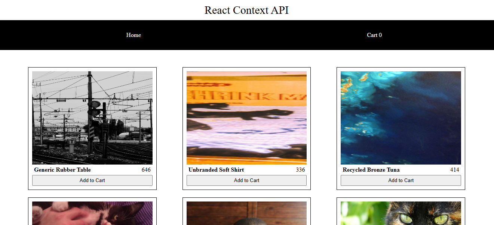

# Context API

## HomePage



## CartPage


Simple eCommerce website with add & remove cart functionality having two pages (homepage & cartpage) to grab the concept of useContext API and its necessity.

## Installing / Getting started

A quick introduction of the minimal setup you need to get the app running.

<br>To create React app through CRA, run the following command:
``` js
npx create-react-app "AppName"
```
The execution speed of the program created through create-react-app (CRA) is slow compared to that of vite. CRA is used to create those app which is bit complex and large.
<br>You can even create react app through vite. Run the following command if you want to create react app via vite;
``` js
npm create vite@latest
```
This create the app. After that you need to write the project & package name (you can even skip this part).
<br>Then choose the required framework using which you intend to build this app.
<br>Then choose the desired variant (Here you have 4 options: TypeScript, TypeScript with compiler, JavaScript & JavaScript with compiler).

Then run the following commands to navigate to the folder:
``` js
cd "folder_name"
```
Install all necessary packages using the following command;
``` js
npm install
```
**OR**
``` js
npm i
```
Then start the app using the following command;
``` js
npm run start
```
On following the link provided, you get to see the sample app.
<br>If you ever intend to change the command for runnig the code, you can do that by making some changes in the package.json file.

### Initial Configuration

1. react-router-dom
<br>Our app is gonna be multipage website, so for that we need react router dom. Install it using the following command;
``` js
npm i react-router-dom
```

2. faker
<br>To get dummy data, we install a dependency called faker.
<br>Install 'faker' using the following command;
``` js
npm install --save-dev @faker-js/faker
```
Then import 'faker' in the file you required;
``` js
import { faker } from '@faker-js/faker';
```
Now you can generate fake data as;
``` js
id: faker.string.uuid(),
Name: faker.commerce.productName(),
```

3. Since, we are dealing with fake objects created using faker.js, we need propTypes to validate the props that component expects in React.
<br> Install propTypes using the following command;
``` js
npm install prop-types
```
Then imprt propTypes in the file where you want to validate using the following command;
``` js
import PropTypes from 'prop-types';
```
After this, you can validate the props
``` js
SingleProduct.propTypes = {
  prod: PropTypes.shape({
    image: PropTypes.string.isRequired,
    name: PropTypes.string.isRequired,
    price: PropTypes.string.isRequired,
  }).isRequired,
};
```

#### Understanding useContext hook

First create a new file and import createContext;
``` js
import { createContext } from "react"
```
<br>Then create a new variable and assign it with createContext function also you need to export it so, it is accessed by all other components which uses props value;
``` js
export const Cart = createContext();
```
Next wrap your children elements with the "variable.Provider" by passing children as props to the function as;
``` js
const Context = ({ children }) => {
  return (
    <>
      <Cart.Provider>
        {children}
      </Cart.Provider>
    </>
  )
}
```
Also in your "main/index.jsx" file, first import "Context" component;
``` js
import Context from './Context.jsx'
```
Then wrap your "App" component with "Context" component
``` js
createRoot(document.getElementById('root')).render(
  <StrictMode>
    <Context>
      <App />
    </Context>
  </StrictMode>,
)
```
Now you can create any variable you want in your "Context.jsx" file using useState hook
``` js
const [cart, setCart] = useState([]);
```
Then add value attributes to your "variable.Provider" wrapper and pass the variable as props
``` js
<Cart.Provider value={{ cart, setCart }}>
```
Now to access it as regular props in all other components you want, you need to import the exported variable/value from "Context.jsx" file as;
``` js
import { Cart } from '../Context';
```
Then dereference the passed value you need and assign it with "useContext" hook. For that you also need to import "useContext" hook
``` js
//importing useContext hook
import { useContext } from 'react';

//dereferencing the required value
const { cart, setCart } = useContext(Cart);
```
For Fast Refresh to detect component changes more accurately, leading to better development performance and fewer potential issues, you can separate the context and provider,
``` js
//CartContext.jsx file
import { createContext } from "react"

export const CartContext = createContext();
```
``` js
//CartProvider.jsx file
import { useState } from 'react';
import { CartContext } from './CartContext';

const CartProvider = ({ children }) => {
  const [cart, setCart] = useState([]);

  return (
    <>
      <CartContext.Provider value={{ cart, setCart }}>
        {children}
      </CartContext.Provider>
    </>
  )
}

export default CartProvider
```

### Building

To build the project for deployment, run the following command;
``` js
npm run build
```

### Deploying/Publishing

To deploy the project on github pages, follow these steps;
<br>1. Put the following code in your 'package.json' file;
``` js
"homepage": "https://myusername.github.io/my-app",
```
Replace 'myusername' with your github username and 'my-app' with your repository name.
<br>2. Then run the following code in terminal to install github pages
``` js
npm install --save gh-pages
```
<br>3. After installing github pages, add the following script in your 'package.json' file;
``` js
"predeploy": "npm run build",
"deploy": "gh-pages -d build",
```
<br>4. To deploy, run the following command;
``` js
npm run deploy
```

## Features

+ Used context API instead of props drilling to make code easier and readable

[comment]: # (## Contributing)

## Links
+ <a href = "https://github.com/chyroshan066/crypto-hunter">Project homepage</a>
+ Other Projects:
  - <a href = "https://github.com/chyroshan066/text-formatter">Text Formatter</a>
  - <a href = "https://github.com/chyroshan066/notes">Notes</a>
+ <a href = "https://github.com/chyroshan066">Profile</a>
  
[comment]: # (## Licensing)

